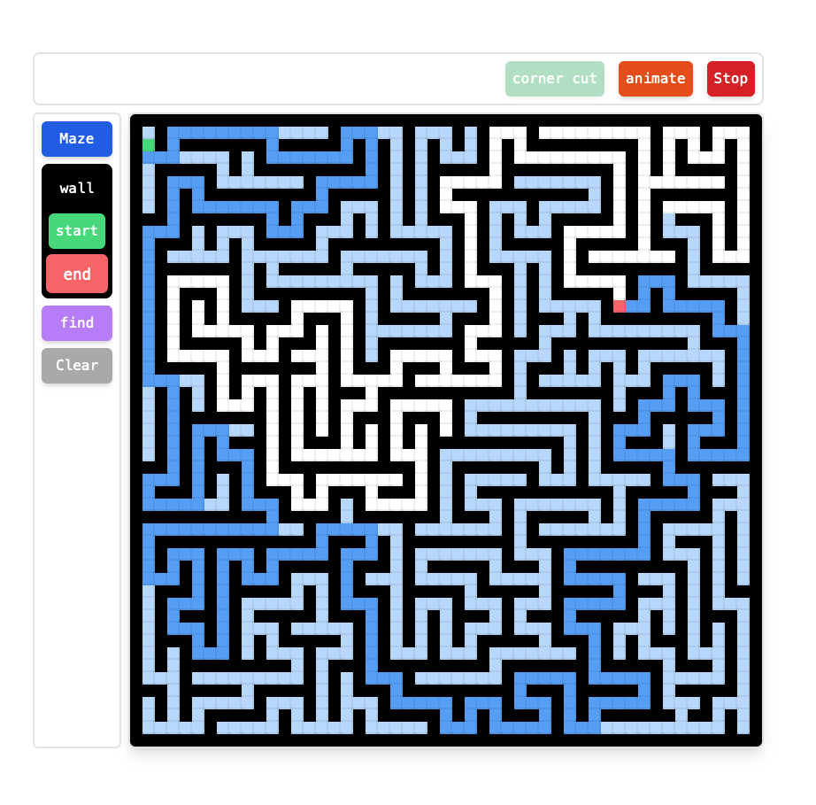

# Maze

A simple learning project I built with sveltekit. I have since greatly improved my typescript, but lack the time and energy to refactor this codebase. Recursive maze generation is mostly working, but not to a level that I find satisfactory. I may one day revisit this project, but for now it is not going anywhere. Not indented for mobile use, severe lack of media queries.

## Stack

Tailwind, Typescript, and Svelte is pretty much the extent of it. Hosted on firebase at sylvansmaze.web.app
